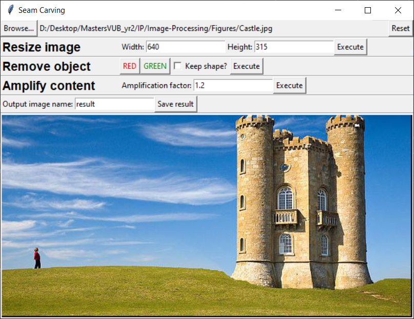

# Image-Processing

Project for the course 'Image Processing' at VUB. The topic is 'Image Retargeting &amp; Object Removal via Seam
Carving' based on the paper by [Avidan &amp; Shamir, 2007](https://github.com/SeppeLampe/Image-Processing/blob/main/Avidan%20%26%20Shamir%20(2007).pdf). The report for this project can be found [here](https://github.com/SeppeLampe/Image-Processing/blob/main/Project%20Report.pdf).

## Setup

You need Python 3 to run this code. It was tested with Python 3.8.

### Anaconda

With a `conda` virtual environment, you need the following packages to successfully run the application:

```
conda install -c anaconda numpy
conda install -c conda-forge opencv
conda install numba
conda install scikit-image
conda install -c conda-forge imutils
```

### Pip

After you created and activated a virtual environment for the project, running the following command should install all
required packages as listed in _requirements.txt_.

```
pip install -r requirements.txt
```

## Application

We provide an intuitive GUI for seam carving functionalities. Run it with:

```
python gui.py
```

The user interface is illustrated below.

